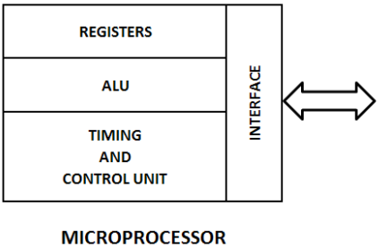
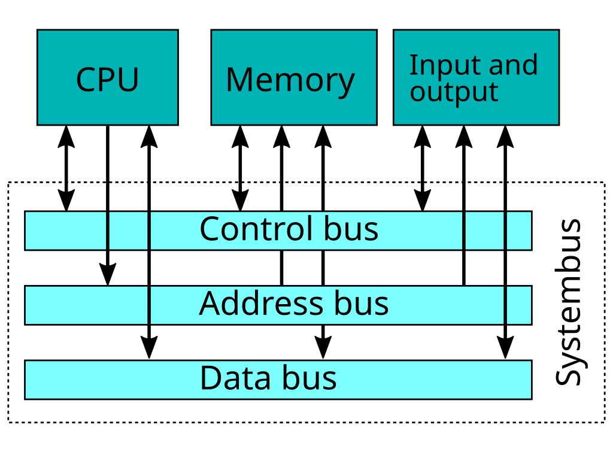
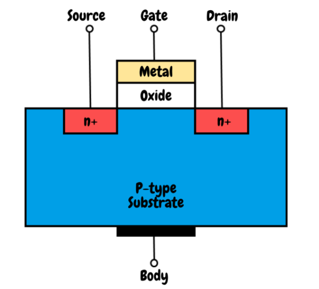
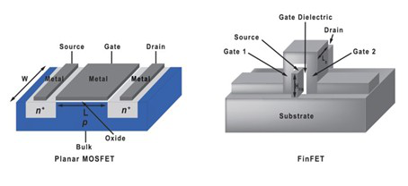
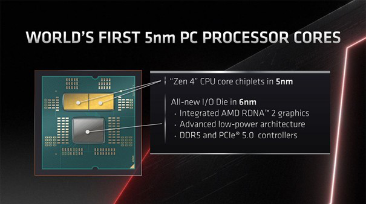
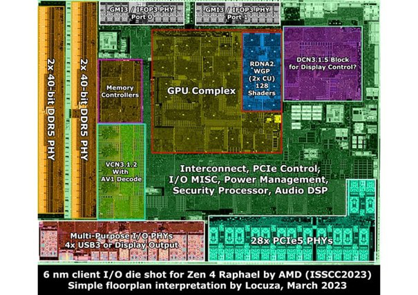

## 1.1 Ce este un procesor  
**Subtitlu:** *Procesoarele moderne: arhitectură și tehnologie*  

Un procesor (sau microprocesor) este componenta principală a unui sistem de calcul, responsabilă cu execuția instrucțiunilor unui program, prelucrarea datelor și coordonarea tuturor celorlalte componente hardware. Practic, el interpretează codul software și transformă instrucțiunile în operațiuni electrice care controlează memoria, perifericele și circuitele interne ale calculatorului.  

Procesele principale efectuate de un procesor includ:

- **Citirea instrucțiunilor** din memoria principală (*fetch*)  
- **Decodarea instrucțiunilor** pentru a determina operația ce trebuie realizată  
- **Executarea operațiilor** (aritmetice, logice sau de transfer de date)  
- **Scrierea rezultatelor** în registre sau memorie  

Fiecare procesor este alcătuit dintr-un număr foarte mare de **tranzistoare**, care sunt comutatoare electronice minuscule ce permit sau opresc fluxul de curent. În procesoarele moderne, aceste tranzistoare sunt organizate în blocuri funcționale, precum unitatea aritmetică și logică (ALU), unitatea de control și memoria cache de diferite niveluri.  

De exemplu, un procesor modern precum **AMD Ryzen 9 7950X** conține peste **6,5 miliarde de tranzistoare**, toate integrate într-o singură plachetă de siliciu. Această densitate extremă de tranzistoare permite procesorului să execute miliarde de operații pe secundă și să gestioneze simultan numeroase sarcini complexe.  

## 1.2 Blocuri funcționale principale  

Procesoarele moderne sunt organizate în mai multe **blocuri funcționale**, fiecare având un rol specific în executarea instrucțiunilor și manipularea datelor. Cele mai importante blocuri sunt:  

### 1.2.1 Unitatea Aritmetică și Logică (ALU)  
ALU este responsabilă pentru **operațiile matematice și logice** efectuate de procesor, cum ar fi adunarea, scăderea, operațiile pe biți (AND, OR, XOR) sau comparațiile. Toate calculele efectuate de software trec prin ALU.  

### 1.2.2 Unitatea de Control  
Unitatea de control interpretează instrucțiunile citite din memorie și generează **semnale de control** pentru restul componentelor procesorului, direcționând fluxul de date între ALU, registre, cache și periferice.  

### 1.2.3 Registrele  
Registrele sunt forme de **memorie internă foarte rapidă**, folosite pentru stocarea temporară a datelor și adreselor. Ele permit procesorului să acceseze imediat informațiile necesare, fără a apela la memoria principală, ceea ce crește semnificativ performanța.  

### 1.2.4 Memoria Cache  
Memoria cache este o zonă de memorie extrem de rapidă, situată în apropierea ALU și a registrelor, care stochează datele și instrucțiunile utilizate frecvent. Aceasta este organizată pe niveluri: **L1, L2 și L3**, fiecare cu capacități și viteze diferite, pentru a optimiza accesul la informații.  

### 1.2.5 Magistrale interne și interconexiuni  
Toate aceste blocuri comunică prin intermediul **magistralelor interne (bus-uri)**, care transferă date și semnale de control între componente. Performanța acestor magistrale influențează direct viteza generală a procesorului.  

Această structură modulară permite **scalarea procesoarelor moderne**: pe măsură ce tranzistoarele devin mai mici și mai numeroase, blocurile funcționale pot fi extinse sau combinate pentru a crește performanța și eficiența energetică.  

## 1.3 Tranzistorul MOSFET și evoluția către FinFET

**Tranzistorul** este elementul de bază al oricărui procesor modern. El funcționează ca un **comutator electronic**, controlând fluxul de curent între două terminale (sursă și drenă) prin intermediul unui al treilea terminal numit **poartă (gate)**. Prin acest mecanism, tranzistorul poate reprezenta un **bit**: 0 (curent oprit) sau 1 (curent pornit).

### 1.3.1 MOSFET – tranzistorul clasic
Tranzistorul **MOSFET** (Metal-Oxide-Semiconductor Field-Effect Transistor) a fost forma dominantă de tranzistor utilizată în procesoarele timp de decenii.

**Avantaje:**
- Dimensiuni reduse și posibilitate de integrare masivă pe siliciu  
- Consum scăzut de energie în regim static  
- Fabricare relativ simplă în tehnologiile DUV (Deep Ultraviolet)

**Limite:**
- La dimensiuni foarte mici (<20 nm), apar efecte de **scurgere a curentului** și **zgomot electric**  
- Controlul precis al canalului devine dificil  

### 1.3.2 FinFET – evoluția modernă
Pentru a depăși aceste limite, industria a trecut la **FinFET (Fin Field-Effect Transistor)**.  
Canalul tranzistorului are forma unei **aripioare verticale**, în loc de un strat plan, oferind:
- **Control mai bun al curentului** și reducerea scurgerilor  
- **Miniaturizare mai eficientă** fără pierdere de performanță  

Procesoarele moderne, precum seria **AMD Ryzen 7000**, utilizează FinFET fabricate pe litografie de **5 nm** sau mai mică, ceea ce permite integrarea a **miliarde de tranzistoare** într-un singur cip.

#### Exemplu vizual
O schemă comparativă MOSFET vs FinFET:

## 1.4 Exemplu practic: AMD Ryzen 7000 (Zen 4)

Seria **AMD Ryzen 7000** utilizează arhitectura **Zen 4**, fiind fabricată pe tehnologia de **5 nm** pentru **Core Complex Dies (CCD)** și pe **6 nm** pentru **I/O Die (IOD)**.  
Această arhitectură modulară include:

- **2× CCD-uri** (fiecare cu până la 8 nuclee)  
- **1× IOD**, care integrează controlerele **PCIe 5.0**, **DDR5** și interfața **AM5**

Această abordare permite **scalabilitate** și **performanță ridicată**, fiind un exemplu concret de utilizare a tranzistoarelor **FinFET** în procesoarele moderne.

### Vizualizare detaliată

Pentru a înțelege mai bine structura internă a unui procesor Ryzen 7000, iată o imagine a die-ului:

Această imagine evidențiază cele trei cipuri principale: două CCD-uri și un IOD, toate integrate pe aceeași plachetă de siliciu.  

Această diagramă ilustrează cum sunt organizate componentele interne și cum interacționează între ele.

### Linkuri utile
- [Wccftech - Ryzen 7000 Delidded](https://wccftech.com/amd-ryzen-7000-desktop-cpu-delidded-ihs-features-gold-plating-with-high-quality-liquid-tim-for-zen-4-ccds-and-io-die/)  
- [ServeTheHome - Ryzen 7000 Die Shot](https://www.servethehome.com/amd-ryzen-7-parts-available-for-pre-order-now/amd-ryzen-die-shot/)  
- [ServeTheHome - Ryzen 7000 SoC Architecture](https://www.servethehome.com/amd-ryzen-7000-series-platform-overview/amd-ryzen-7000-soc-architecture-soc-topology-with-2x-ccd-1x-iod/)

