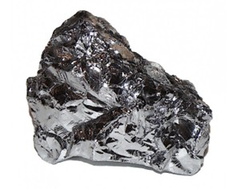
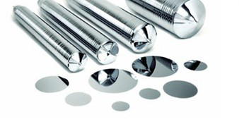

# 2. De la siliciu la plachetă

## 2.1 Obținerea siliciului pur

Siliciul este un element comun în natură, prezent în special sub formă de **dioxid de siliciu (SiO₂)**, component esențial al nisipului și cuarțului.  
Pentru aplicații în microelectronică, este necesar **siliciu extrem de pur** (99,9999…% sau mai mult), numit **siliciu electronic**.  

Obținerea acestuia se face printr-o serie de procese chimice și termice:

- Reducerea SiO₂ cu carbon sau hidrogen pentru a obține siliciu metalic  
- Purificarea prin procese chimice (procesul **Siemens** sau **Czochralski** pentru siliciu de înaltă puritate)  
- Obținerea unui material cu impurități controlate pentru **dopare ulterioară**

## 2.2 Cristalizarea monocristalului

Siliciul pur obținut este transformat într-un **monocristal cilindric** folosind **procesul Czochralski**:

1. O cantitate de siliciu pur topit este plasată într-un cadru special la temperaturi foarte ridicate (≈1420°C).  
2. Un cristal-semănător este scufundat în topitura de siliciu și rotit lent.  
3. Pe măsură ce cristalul este ridicat, siliciul se solidifică în jurul nucleului, formând un **cilindru uniform**, numit „ingot”.

### Motivul formei rotunde

Forma cilindrică apare natural datorită rotației și tensiunii superficiale a siliciului topit.  
Aceasta permite, mai târziu, **tăierea waferelor rotunde** fără pierderi semnificative și cu o distribuție uniformă a proprietăților cristaline.

---

## 2.3 Tratare termică și chimică a plachetei

După obținerea monocristalului, ingot-ul de siliciu este tăiat în **wafer-e** cu diametrul tipic de **300 mm**, folosind lame extrem de precise, de obicei diamantate.  
Fiecare wafer trece prin mai multe etape pentru a fi pregătit pentru litografie și fabricarea tranzistorilor.

Suprafața waferului este mai întâi **șlefuită** și apoi **polisată** prin procesul de **Chemical Mechanical Polishing (CMP)**, care asigură o suprafață perfect plană și netedă la nivel nanometric.  
Această uniformitate este esențială pentru litografia de înaltă precizie.

După șlefuire, waferul este supus unei **curățări chimice** complexe, care elimină particulele, reziduurile metalice și alte impurități.  
Procesul de curățare este repetat de mai multe ori pentru a garanta o suprafață ultra-curată, fără contaminanți care ar putea afecta litografia și performanța tranzistorilor.

Următorul pas este **tratamentul termic (annealing)**, în care waferul este încălzit în mod controlat pentru a stabiliza cristalele de siliciu și a reduce defectele interne.  
Această etapă ajută la uniformizarea tensiunilor interne și la îmbunătățirea proprietăților electrice ale semiconductorului.

După ce suprafața este pregătită, se aplică un **strat subțire de photoresist**, material fotosensibil care va permite **modelarea precisă a tranzistorilor** în etapele de litografie.  
Grosimea și compoziția stratului de rezist sunt adaptate în funcție de tehnologia folosită și de dimensiunea tranzistorului.

În timpul expunerii la lumină UV, DUV sau EUV, rezistul va defini regiuni specifice care vor fi ulterior gravate sau dopate, creând structurile necesare pentru tranzistoare și interconexiuni.

Acești pași pregătesc waferul pentru etapele următoare, cum ar fi **depunerea straturilor**, **doparea** și **metalizarea**, asigurând că suprafața este uniformă, curată și optimă pentru fabricarea tranzistoarelor.

