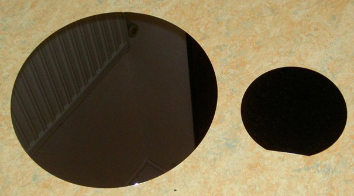
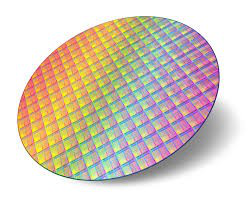
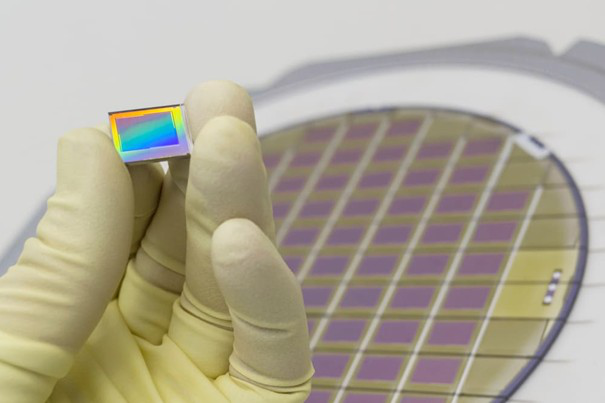

# 3. De la plachetă la cip

După obținerea plachetei de siliciu perfect curată și plană, urmează una dintre cele mai complexe secvențe tehnologice din lume: transformarea unui disc de siliciu într-un cip logic conținând miliarde de tranzistoare.  
Procesul cuprinde etape succesive de **depunere**, **litografie**, **etching**, **dopare**, **metalizare** și **tăiere**.

---

## 3.1 Depunerea straturilor (Film Deposition)

Procesul începe cu aplicarea unor filme subțiri de materiale semiconductoare, izolatoare sau metalice peste wafer.  
Scopul este de a construi straturi suprapuse care definesc viitoarele componente ale tranzistorului.

### Tipuri de depuneri:

- **Depunere chimică din vapori (CVD – Chemical Vapor Deposition)**  
  Se bazează pe reacții chimice în fază gazoasă.  
  Exemplu: formarea de dioxid de siliciu prin oxidarea silanului:  
  `SiH₄ + O₂ → SiO₂ + 2H₂`  
  Se obțin filme dense, cu grosimi de ordinul zecilor de nanometri.

- **Depunere fizică (PVD – Physical Vapor Deposition)**  
  Materialul este vaporizat (prin sputtering sau evaporare) și condensează pe wafer.  
  Se folosește la straturi metalice precum aluminiu, cupru sau titan.

- **Depunere atomică (ALD – Atomic Layer Deposition)**  
  Se aplică strat cu strat, controlat la nivel de un monostrat atomic.  
  Asigură grosimi uniforme, esențiale pentru tehnologiile sub-10 nm.

## 3.2 Litografia – Transferul modelului circuitului

După depunerea stratului, se aplică un **fotorezist fotosensibil**.  
Apoi, lumina (UV, DUV sau EUV) este folosită pentru a expune regiuni specifice conform unei măști.  

- **UV (365 nm)** – generațiile vechi, până la 250 nm  
- **DUV (193 nm, ArF laser)** – standardul folosit în ultimele două decenii  
- **EUV (13,5 nm)** – tehnologia actuală de vârf, detaliată în capitolul următor  

După expunere, fotorezistul este **dezvoltat**: zonele expuse devin solubile și sunt îndepărtate.  
Rezultatul: un **model fizic** pe suprafața waferului.

## 3.3 Etching (Gravarea selectivă)

Procesul de etching elimină materialul expus, transferând modelul din fotorezist în stratul de dedesubt.

- **Etching umed (Wet Etching)** – reacții chimice lichide; isotrop, dar mai puțin precis  
- **Etching uscat (Plasma Etching / RIE)** – folosește ioni accelerați într-un câmp electric  

Formula de bază pentru viteza de gravare:

\[
R = \frac{d}{t}
\]

unde *R* este rata de gravare, *d* grosimea materialului eliminat și *t* timpul procesului.  
Rata tipică: **1–10 nm/s**.

## 3.4 Doparea (Implantarea ionică)

Pentru a controla conductivitatea electrică a siliciului, se introduc **atomi dopanți** (bor pentru p-type, fosfor sau arsen pentru n-type).  
Aceasta se face prin **implantare ionică**, accelerând ionii în câmpuri de ordinul sutelor de keV:

\[
E_k = \frac{1}{2}mv^2
\]

Ionii pătrund în rețeaua cristalină și sunt ulterior **activați termic (annealing)**, pentru a se integra în structura siliciului.

## 3.5 Metalizarea și interconectarea

După formarea tranzistoarelor, trebuie realizate milioane de **conexiuni electrice** între ele.  
Se depun succesiv straturi de **cupru** și **dielectric**, apoi se gravează canale pentru **via-uri** și interconectări.

Procese moderne:

- Dual Damascene Cu Metallization  
- Low-k Dielectrics  
- CMP (Chemical Mechanical Polishing)

## 3.6 Tăierea (Dicing) și testarea cipurilor

După completarea tuturor straturilor (peste 100 în total), waferul este **testat optic și electric**.  
Apoi este **tăiat (dicing)** cu un disc diamantat în mii de cipuri individuale.

Randamentul (*yield*):

\[
Y = e^{-AD_0}
\]

unde *A* este aria cipului și *D₀* densitatea defectelor.

## 3.7 Detalii interesante

- **Timpul de expunere** pentru un wafer complet este de ~**18 secunde**  
- **O linie completă de producție**: peste **20 miliarde USD**  
- **Un scanner EUV**: ≈ **200 milioane USD**  
- **Grosimea totală** a straturilor depuse: > **10 µm**, fiecare strat sub **10 nm**

