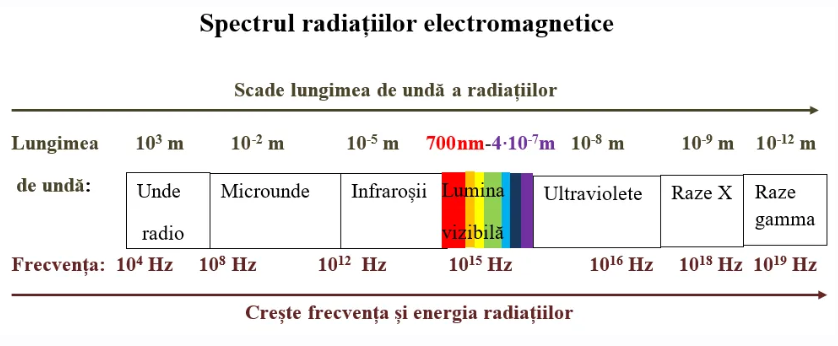
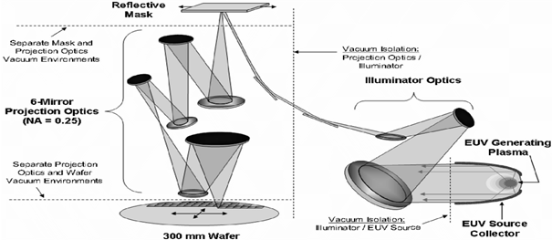

# 4. Litografia EUV explicată

Litografia **EUV (Extreme Ultraviolet)** este tehnologia centrală care permite fabricarea cipurilor moderne la noduri de **5 nm**, **3 nm** și, în curând, **2 nm**.  
Ea utilizează lumină cu o lungime de undă de **13,5 nm**, situată între domeniul ultravioletului clasic și razele X.  
Această scurtare a lungimii de undă permite imprimarea unor detalii de ordinul câtorva nanometri, imposibil de realizat cu metodele optice clasice.

---

## 4.1 Energia fotonului EUV

Formula energiei unui foton EUV:

\[
E = \frac{h \cdot c}{\lambda}
\]

unde  
- `h = 6,626×10⁻³⁴ J·s`  
- `c = 3,00×10⁸ m/s`  
- `λ = 13,5×10⁻⁹ m`

Rezultatul:

\[
E ≈ 1,47×10⁻¹⁸ J ≈ 9,16 eV
\]

Această energie este suficientă pentru a excita electronii din stratul rezist fotosensibil.

---

## 4.2 Componentele sistemului EUV

Un sistem complet de litografie EUV (ex. **ASML Twinscan NXE**) include:

- **Sursa de lumină EUV** – plasmă de staniu lovită de un laser CO₂  
- **Optica de iluminare** – modelează fasciculul luminos  
- **Masca de litografie** – conține modelul circuitului  
- **Optica de proiecție** – reduce imaginea măștii (~4×)  
- **Wafer-ul** – substratul de siliciu

---

## 4.3 Fenomene fizice în procesul EUV

### 4.3.1 Generarea luminii EUV
Jet de staniu lichid (~30 μm) este excitat de un laser CO₂ pulsator → plasmă de ~100 000 K.  
Ionii Sn⁸⁺–Sn¹⁴⁺ emit la ~13,5 nm.  
Doar ≈ 2 % din energia laserului devine lumină EUV utilă.

---

### 4.3.2 Reflexia luminii EUV – oglinzile Bragg
Lumina EUV nu poate fi focalizată cu lentile.  
Sunt folosite **oglinzi multistrat Mo/Si** (~7 nm fiecare pereche, până la 50 straturi).  
Reflectivitate ≈ 70 %.

Cond. Bragg:  
\[
2d \sin(θ) = nλ
\]

Sistemul folosește max. 6 oglinzi și funcționează în vid complet.

---

### 4.3.3 Interacția cu rezistul fotosensibil
Fotonii EUV eliberează electroni secundari → reacții chimice → modifică solubilitatea locală.  

Cerințe rezist:  
- Sensibilitate ridicată  
- Rezoluție nanometrică  
- Stabilitate chimică și termică

---

## 4.4 Limitări și provocări tehnologice

- **Absorbția totală:** nu există materiale transparente la 13,5 nm → sistem în vid  
- **Randament scăzut:** 1–2 % energie convertită  
- **Măști sensibile:** se pot contamina cu staniu  
- **Erori stochastice:** la 2–3 nm, fluctuații de expunere  
- **Costuri:** > 100 000 componente, 180 tone, > 200 milioane USD

